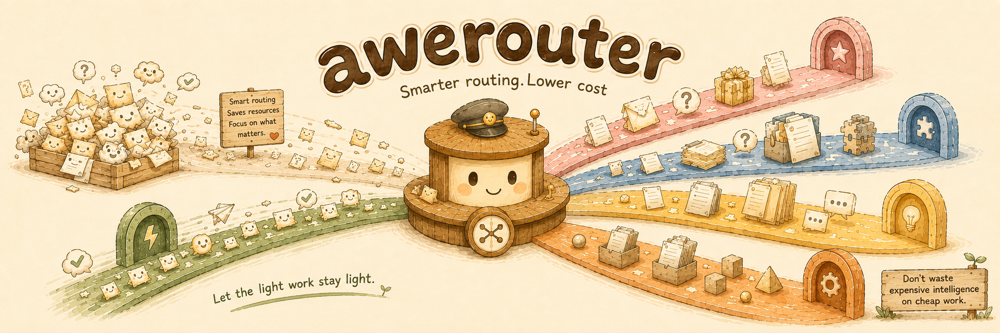

# awerouter：四层路由器的设计哲学

每一个路由工具每天都要回答同一个问题上千次：*这个请求——该走便宜模型，还是强模型？*

大多数工具的回答方式是“试图理解”请求：跑一个 LLM 分类器、匹配关键词列表、把会话历史喂进一个评分函数。这些做法共享一个隐藏成本：它们消耗 token、增加延迟，而且更糟的是——它们是在猜。分类器两个方向都可能错；一次错误的路由，要么浪费钱，要么降级质量，对你来说都不可见。

awerouter 换了个打法：**从结构路由，而非从语义路由。** 一个请求的形状——它声明了什么工具、携带了什么 model id、堆了多少 token、agent 刚才做了什么——已经足够做出好的路由决策，而且读这些信号是免费的。

这个赌注决定了之后的一切。下面就是四层背后的设计哲学。

GitHub: [github.com/mugpeng/awerouter](https://github.com/mugpeng/awerouter)

## 四层，四个不同的问题

路由器是一个 first-match-wins 管线。每一层只问一个问题，第一个触发的问题决定路由。顺序不是随意的——它按照问题确定性的从高到低排列。

**L1 问：flash 能不能做这件事？** 如果请求声明了一个 web-search或者工具，这个问题就不是难度，而是能力——很多廉价 provider 根本不支持它。能力约束是绝对的。它压过一切，哪怕请求只有一行。对一个其中一种工具根本完成不了的工作，你不需要纠结“锤子和手术刀哪个更好”。

**L2 问：客户端已经决定了吗？** 有些客户端——最典型的是 Claude Code 的 model picker——已经把任务分成了 tier：background 还是 think。当客户端说“这是一个 background 任务”，那不是需要你解读的信号，而是一条指令。重新推导客户端已经告诉你的东西，等于为同一个决定付两次费。路由器信任客户端自己的 tier label，直接路由。

**L3 问：这个请求到底有多大？** 这里路由器是在“测量”，而不是“解读”。如果请求携带的内容超过阈值——或者包含一张图片，廉价模型在视觉上会降级——它就走到强 tier。这是唯一一层在“估计”难度，而且估计刻意做得粗糙：一个 token 数对照一个刻度盘。不是分类器，是一把卷尺。

**L4 问：当前会话处于什么阶段？** 最近一次工具调用是一个诚实得令人意外的信号。一个刚跑完搜索的 agent 处于机械阶段——读下一个命中的文件、列下一个 glob。一个刚做完编辑的 agent 处于后果攸关的阶段——代码正在被写入或校验。搜索结果喂养的是廉价后续步骤；一次 fresh edit 值得更强模型。工具阶段是四层里最弱的信号，这正是它排在最后的原因。

| 层 | 问题 | 确定性 |
|---|---|---|
| L1 能力 | flash 能不能做？ | 硬约束 |
| L2 意图 | 客户端选了哪个 tier？ | 客户端的显式指令 |
| L3 难度 | 内容有多大？ | 一次测量 |
| L4 阶段 | agent 刚才做了什么？ | 一个启发式 |

层级从绝对约束一路降到有根据的猜测。硬约束压过指令；指令压过测量；测量压过启发式。当两层意见不同时，确定性更高的那一层决定。这就是全部的顺序。

## 默认 cheap：无罪推定

一个请求在没有触发任何层时的默认路由——是 cheap tier。

这是一个刻意的倒置。大多数路由系统默认强模型，再把“简单”请求降级。awerouter 反过来：默认 flash，只把*有理由*的请求提升上去——需要 flash 不具备的能力、携带显式 tier label、超过难度阈值、或处于编辑阶段。举证责任在请求身上，不在你的钱包上。

这种不对称来自失败模式的不对称。把一个难请求送给弱模型，会产生一个坏答案——响亮、可见、最终会被注意到。把一个简单请求送给强模型，会在三倍价格下给出正确答案——安静、不可见、永远在累积。路由器偏向你能看见的那种失败，因为你看不见的那种，才是持续烧钱的那一种。

## 测量“难”，而不是测量“大”

L3 的 token 检查有一个值得单独拿出来说的细节：不是所有 token 都同样“难”。

文件搜索结果——grep 匹配、glob 清单、目录树——是 bulk 机械数据。它们会急剧撑大请求的体积，但对推理难度的贡献几乎为零。一个塞了两百个文件路径的上下文是*大*，但不是*难*。如果路由器按原始大小比较，每一次搜索密集的会话都会仅仅因为自己的文件清单就被提升到 pro——为本质上是一份放大版 `ls` 的输出支付 pro 价格。

所以搜索结果里的 token 在与阈值比较前会被打折。路由器测量的是真正对模型构成压力的那部分上下文：对话、system prompt、tool 定义、推理载荷。批量数据廉价地搭车。测量难度，不测量吨位。

## 单向门

设计中有两处，跨越一条线是不可逆的——而不可逆正是重点。

**长上下文跨越只往上走。** 一旦一个会话的有效 token 数超过阈值，它就走 pro 并待在那里，不管接下来跑了什么工具。低于阈值时，会话可以交替——搜索阶段走 flash，编辑阶段走 pro。高于阈值后，会话被锁定。这能把廉价模型和它可能降级的上下文规模隔开。一个路由器如果把一个长会话因为一次廉价工具调用弹回 flash，那省下的是几分钱，触碰的是一个能力悬崖。

**流式开始后不再回退。** 如果廉价 provider 在第一个字节到达客户端*之前*失败，请求会静默重试一次强 tier。如果失败发生在流式开始*之后*，不再重试——已经发出的字节不能被收回。回退本身遵循和路由相同的哲学：它只往安全的方向走，从便宜到强，绝不反向。强 provider 的失败是终局；没有更高的层级可以升级。

## 路由器不读你的对话

设计里最不寻常的一条约束是：响应路径是不透明的。路由器从不解析、缓冲或检查上游返回的内容。响应字节从 provider 到客户端原样流过。

这关闭了一整类“更聪明”的路由器——那些读取输出、判断质量、在反馈循环里调整路由的做法。awerouter 做不到，也选择不假装能做到。不读取响应，就没有质量的 ground truth，因此也不可能诚实地构建一个质量敏感的路由器。假装相反，就意味着用一个基于猜测的反馈循环。

取而代之，路由器把自己限制在它能诚实且廉价读取的信号上：请求的结构。每一个决定都来自首字节之前就可以测量的事实——工具声明、model id、token 数、上一次工具调用。零分类成本。诚实本身就是设计：这个工具不假装知道自己看不到的东西。

## 每一个决定都有一个名字

最后，路由器给每一个解析过的请求贴上一个 label：`webSearch`、`background`、`think`、`longContext`、`image`、`toolEdit`、`toolSearch`、`default`——以及在廉价 tier 失败被救回时加上 `→fallback`。

这不是装饰。一个结构路由器赢得信任的方式，和它做决定的方式一样：可解释。当你看着使用分析里 70% 的 `default` 和 14% 的 `longContext` 时，你看到的不是一个黑箱的判决，而是每一个请求*哪一个问题触发了*的完整记录。任何一次路由决定都可以从它的 label 回放。任何阈值都可以从记录的分布里重新校准。

一个靠猜的路由器只能靠感觉为自己辩护。一个只做测量的路由器只需要展示工作过程——而它确实做到了。

## 重述这个赌注

剥开四层，哲学就是一句话：**请求的结构已经告诉你足够多关于它的成本和难度的信息，读取这个结构是免费的，而一个路由器不应该在 token、延迟或风险上付费，去做一个它本可以零成本做出的决定。**

四个问题，从确定性到猜测排列，配上一个廉价默认值和单向安全门。没有分类器。没有关键词。没有先知。只有测量，以及诚实的边界。
